```{r setup, include=FALSE}
knitr::opts_chunk$set(echo = FALSE)
```

# [Background]{.underline}

-   Investigating blood-derived expression patterns can provide a detailed snapshot of an organism's biological status at time of collection.

-   However, obtaining an accurate representation of a sample's expression profile is fraught with confounding factors such as time spent in vitro and exogenous environmental factors such as temperature, light, and contaminants.

-   Some commercial sample collection kits, such as Qiagen's PAXgene, promise to stabilize intracellular RNA via a proprietary blend of reagents.

-   This study aims to compare the efficacy of the PAXgene blood collection system against a standard serum collection system via differential expression analysis.

------------------------------------------------------------------------

# [Approach]{.underline}

1.  Transform sRNAseq data into a DESeq2-legible format.

2.  Analyze and plot DESeq2 output to investigate potential differences in expression patterns between the Serum and PAXgene matrices.

3.  Make workflow recommendations based on findings.

------------------------------------------------------------------------

# [Workflow Overview]{.underline}

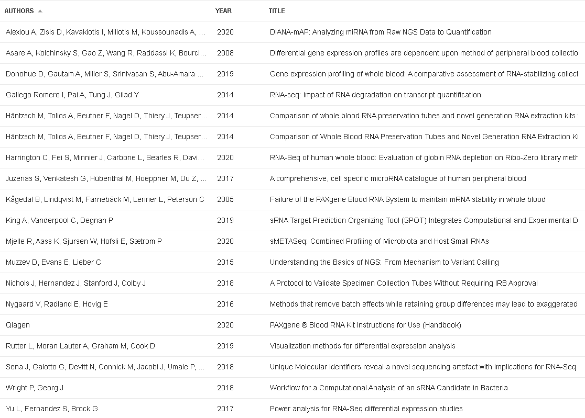

{alt="This project was heavily front loaded with journal-diving."}

------------------------------------------------------------------------

# [Pipeline Walkthrough]{.underline}

## Pre-Processing Steps

1.  Load data
2.  Inspect data for inconsistencies
3.  Merge datasets to capture all columns/rows in one object
4.  Run quick logical check to determine if rRNA filtering is recommended\*
5.  Filter rRNA

## Load necessary packages

```{r, eval=F, echo=T}
library(DESeq2)
library(tidyverse) 
library(Glimma)
library(IHW)
library(pheatmap)
library(data.table)
library(reshape2)
library(svDialogs)
library(beepr)
```

## Set working directory

```{r, eval=F, echo=T}
setwd('C:/Users/etmul/R/Generate')
```

## Load files

```{r, eval=F, echo=T}
counts <- read.csv('counts.csv')
samples <- read.csv('samples.csv')
markers <- read.csv('markers.csv')
```

## Verify uniqueness of provided sample and marked IDs

```{r, eval=F, echo=T}
n_occur <- data.frame(table(samples$sample_id))
y <- n_occur[n_occur$Freq > 1,]
if (!is.null(y$Var1))
  print("There are no duplicate sample IDs. Nice!")

x_occur <- data.frame(table(markers$marker_id))
z <- x_occur[x_occur$Freq > 1,]
if (!is.null(z$Var1))
  print("There are no duplicate marker IDs. Cool!")
```

## Merge dataframes

```{r, eval=F, echo=T}
counts_markers <- inner_join(counts, markers)
counts_samples <- inner_join(counts, samples)
total <- inner_join(counts_markers, counts_samples)
```

## Calculate percentage of rRNA and issue warning if necessary

```{r, eval=F, echo=T}
percent_rRNA <- sum(total$mapped_gene_type == "R_RNA") / nrow(total) * 100
cat(sprintf("This dataset contains %.2f%% rRNA.", percent_rRNA))
if (percent_rRNA > 10) {
  dlg_message(paste0("Warning: Dataset contains ", percent_rRNA,"% rRNA - consider filtering."))
  }
```

## Filter rRNA

```{r, eval=F, echo=T}
mir <- total %>% filter(mapped_gene_type != "R_RNA")
```

------------------------------------------------------------------------

# [**Creating counts object for DESeq2**]{.underline}

1.  Subset sample_id, marker_id, and read_count columns from mir
2.  Convert subset, cts, to n x m matrix
3.  Store samples.csv as colData column
4.  Transform and reorder cts and colData objects so that colnames in cts match rownames in colData

```{r, eval=F, echo=T}
cts <- subset(mir, select = c(sample_id, marker_id, read_count))
cts <- tapply(cts$read_count, cts[2:1], FUN = mean)
cts = as.data.frame(cts)
cts[is.na(cts)] <- 0

```

## Transforming the Data

1.  Do the column names of cts match row names in colData?
2.  Are the column names of cts in the same orders as the row names in colData?

```{r, eval=F, echo=T}
colData <- samples
row.names(colData) <- colData$sample_id
```

### Check that column names in cts match row names in colData and in the same order.

```{r, eval=F, echo=T}
colData<- colData[order(colData$sample_id),]
cts[order(as.numeric(row.names(cts))),]
samples$replicate_id <- make.unique(c(as.character(samples$replicate_id)))
samples$matrix_type <- as.factor(samples$matrix_type)
```

### Check if colnames in cts match the row names in colData

```{r, eval=F, echo=T}
if(all(colnames(cts) %in% rownames(colData))) {
  print("Match") 
} else {
  
  dlg_message("Name mismatch. Please double check your column and row names.")
  
}
```

### Check if the colnames in cts are in the same order as the rownames in colData

```{r, eval=F, echo=T}
if(all(colnames(cts) == rownames(colData))) {
  print("Match") 
} else {
  
  dlg_message("Order mismatch: Please ensure columns are in same order as rows!")
}
```

------------------------------------------------------------------------

# [Creating DeSeq2 Object]{.underline}

### Generate dds object

```{r, eval=F, echo=T}
dds <- DESeqDataSetFromMatrix(countData = cts,
                              colData = colData,
                              design = ~ matrix_type)
```

### Filter rows with less than 10 read counts

```{r, eval=F, echo=T}
keep <- rowSums(counts(dds)) >= 10
dds <- dds[keep,]
```

### Set factor level

```{r, eval=F, echo=T}
relevel(dds$matrix_type, ref = "Serum")
```

### Group biological and technical reps by study

```{r, eval=F, echo=T}
dds <- collapseReplicates(dds, groupby = dds$replicate_id, run = dds$study)
```

### Run DESeq2

```{r, eval=F, echo=T}
dds <- DESeq(dds)
beep(5) # make noise to indicate completion
```

------------------------------------------------------------------------

# [Exploring and Plotting]{.underline}

### Examining results

```{r, eval=F, echo=T}
res <- results(dds)
res_adj <- results(dds, alpha = 0.01)
```

### Normalize via log fold change transform

```{r, eval=F, echo=T}
resLFC <- lfcShrink(dds, coef="matrix_type_Serum_vs_PAXgene", type="apeglm")
resLFC
```

### Generate MAplot of results

```{r, eval=F, echo=T}
plotMA(resLFC)
plotMA
```

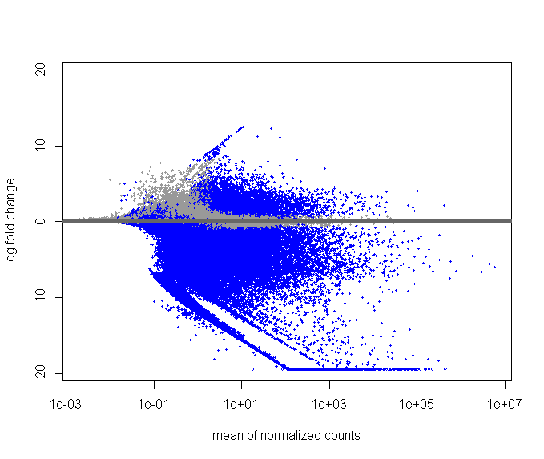

## PCA Plots

### Before Batch Correction

```{r, eval=F, echo=T}
vsd <- vst(dds)
plotPCA(vsd, "study")
```

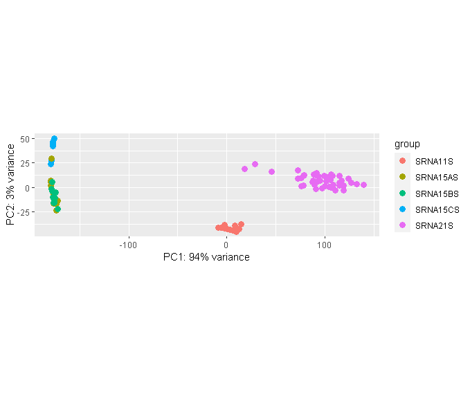

Technical replicates have been grouped with corresponding biological replicates via DESeq2's collapseReplicates function.

```{r, eval=F, echo=T}
mat <- assay(vsd)
mm <- model.matrix(~matrix_type, colData(vsd))
mat <- limma::removeBatchEffect(mat, batch= vsd$study, design= mm)
assay(vsd) <- mat
plotPCA(vsd, "study")
```

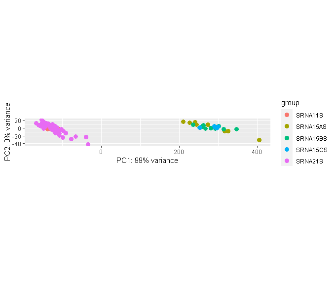

Serum groups (SRNA15AS, SRNA15BS, SRNA15CS) cluster neatly, while there exists appreciable distance between the two PAXgene groups (SRNA11S, SRNA21S). This is expected as SRNA11S and SRNA21S are two separate runs. Batch correction supports this.

## Heat Map

```{r, eval=F, echo=T}
select <- order(rowMeans(counts(dds,normalized=TRUE)),
                decreasing=TRUE)[1:20]
df <- as.data.frame(colData(dds)[,c("matrix_type","donor_id")])
pheatmap(assay(vsd)[select,], cluster_rows=FALSE, show_rownames=TRUE,
         cluster_cols=FALSE, annotation_col=df)
```

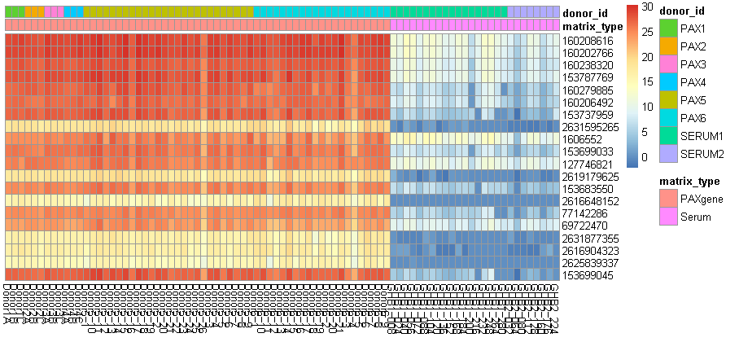

A heatmap where individual cells correspond to the average expression level of a given marker_ID for a given donor_ID.

Heatmap cells are clustered by both matrix_type and donor_id and highlight a difference in average expression levels between the Serum and PAXgene matrices.

# [Interactive Plots]{.underline}

### MDS plot

```{r, eval=F, echo=T}
glimmaMDS(dds, continuous.color=TRUE)
```

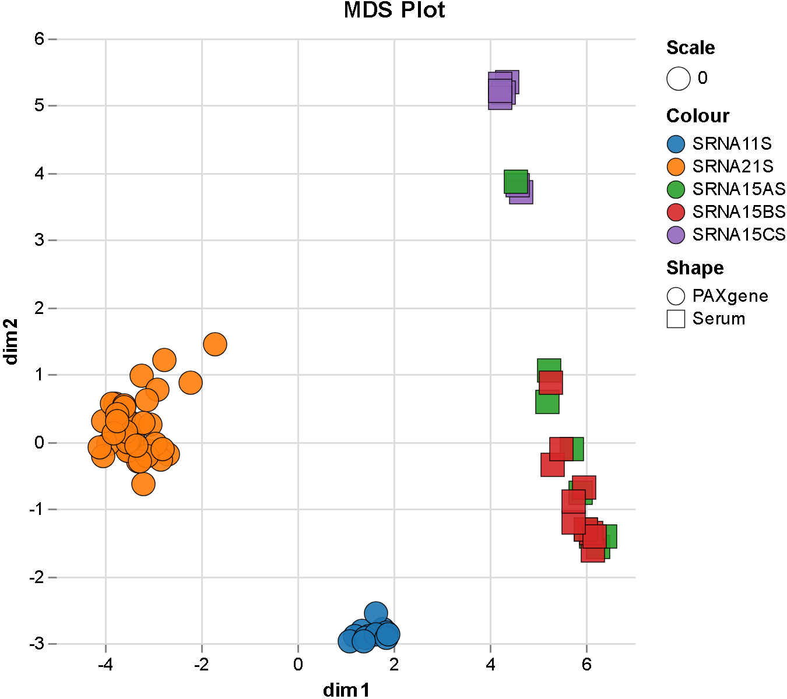


### MA plot

```{r, eval=F, echo=T}
glimmaMA(dds, counts = dds$sample_id)
```

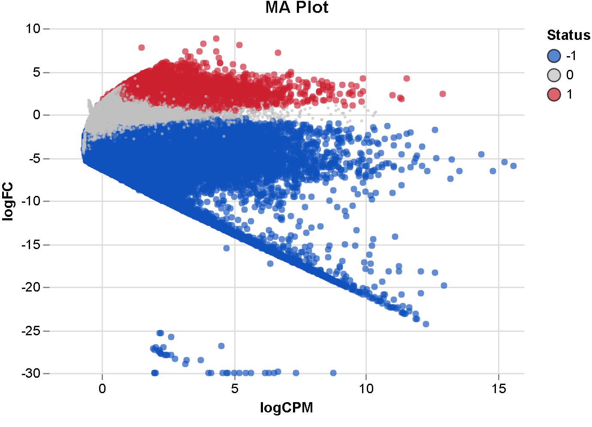

### Volcano plot

```{r, eval=F, echo=T}
glimmaVolcano(dds, counts = dds$matrix_type_Serum_vs_PAXgene, groups = dds$matrix_type)
```

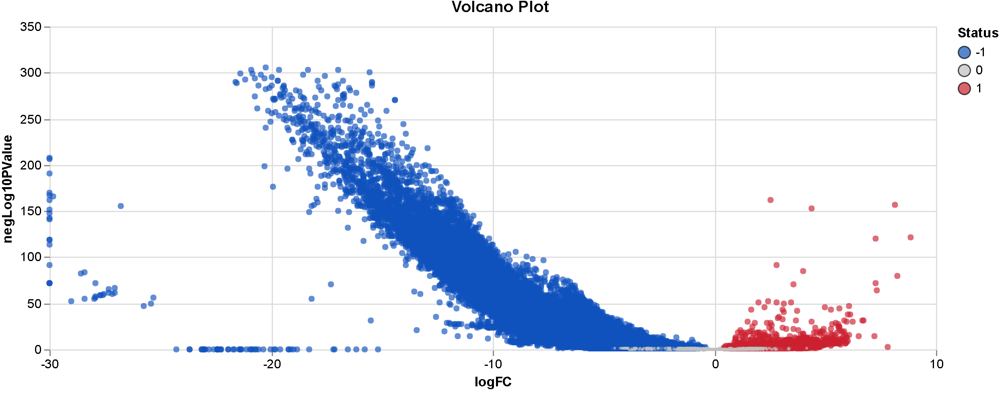

------------------------------------------------------------------------

# [Discussion]{.underline}

## Samples processed through the Serum matrix display:

1.  Lower average expression levels than those processed through the PAXgene matrix.
2.  Less significantly expressed genes than those processed through the PAXgene matrix.

Unlike the Serum matrix, the PAXgene system lyses cells immediately upon collection, thus preserving intracellular RNA integrity by reducing opportunities for continued transcription/translation post-collection.

Processing delays as little as 4 hours can affect expression profiles, especially in immune response genes3. Therefore, it is possible that these differences in expression patterns arose due to differences in RNA integrity post-collection; self-hydrolysis/transcription/translation is still occurring in vitro in the Serum group, potentially degrading the signal.

Based on these findings, it is recommended to continue with the PAXgene matrix given its ability to control for in vitro RNA degradation...

However, provided the varying laboratory conditions between groups: Serum: 3 bio reps + 3 tech reps Paxgene: 1 bio rep + 1 tech rep, + 1 separate bio rep

It is recommended to structure experimental groups more symmetrically\* if further exploration of differences between the two systems is desired.

```         
     Serum: n bio reps + n tech reps
     Paxgene: m bio reps + m tech reps
```

Additionally, to reduce downstream batch effects, it is recommended to split the two groups evenly between batches, so systemic differences will not affect different experimental groups in different ways.

------------------------------------------------------------------------

# [Additional/Optional Tests]{.underline}

## Inspecting Individual Genes

### Plot counts of gene with smallest adjusted p value

```{r, eval=F, echo=T}
plotCounts(dds, gene=which.min(res$padj), intgroup="matrix_type")
gene <- as.character(rownames(resOrdered[1,]))
gene
```

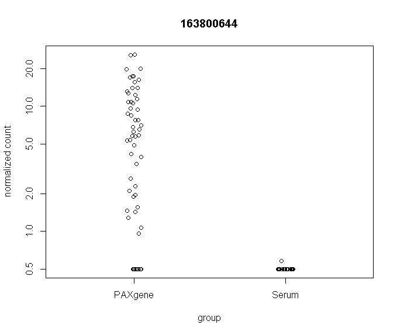

### Inspect all rows matching gene of interest

```{r, eval=F, echo=T}
SigGene <- as.data.frame(mir[str_detect(mir$marker_id, gene), ])
view(SigGene)
```

### Examine counts of a single gene across study groups

```{r, eval=F, echo=T}
yrmarker1 <- as.character(dlgInput("Enter marker ID of interest.")$res)
plotCounts(dds, gene=yrmarker1, intgroup="matrix_type")
yrgene1 <- as.character(filter(mir, mir$marker_id == yrmarker1)[2, 8])
yrgene1
```

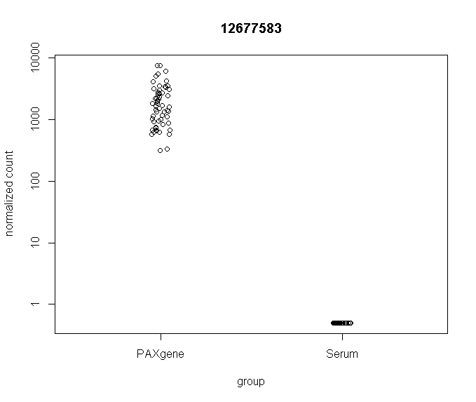

## Inspecting PBMC Marker Genes

### Search for common canonical PBMC marker genes (CD- and IL- families)

```{r, eval=F, echo=T}
imm <- mir[str_detect(mir$mapped_gene_name, "^CD[0-9]|^IL[0-9]"), ]
if(nrow(imm) == 0) {
  print("Marker(s) not found.") 
} else {
  view(imm)
}
```

### Generate dataframe of found CD-/IL- genes

```{r, eval=F, echo=T}
resM <- setDT(as.data.frame(resOrdered), keep.rownames=TRUE)
colnames(resM)[1] <- "marker_id"
resM$marker_id <- as.double(resM$marker_id)
immM <- inner_join(resM, imm)
view(immM)
```

### Inspect unique marker_ids

```{r, eval=F, echo=T}
immt <- immM[!duplicated(immM$marker_id), ]
view(immt)
```

### Plot number of CD-/IL- markers captured by matrix_type

```{r, eval=F, echo=T}
immpy <- count(immM, var = matrix_type)
immp <- ggplot(data = immM, aes(x=matrix_type)) +
  geom_bar()
print(immp + ggtitle("CD-/IL- Markers Captured by Matrix Type"))
```

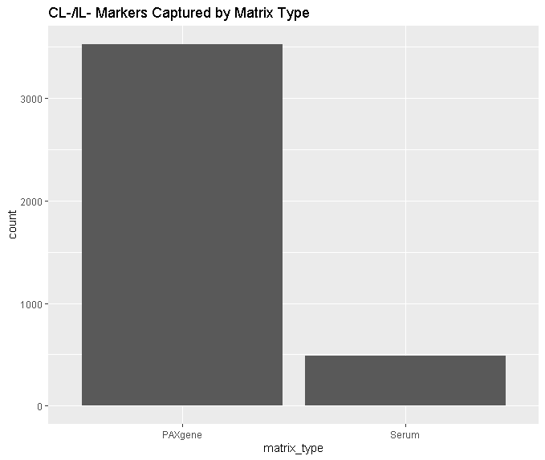

### Inspect significant immunity markers

```{r, eval=F, echo=T}
yrmarker2 <- as.character(dlgInput("Enter marker ID of interest.")$res)

yrgene2 <- as.character(filter(immM, immM$marker_id == yrmarker2)[1, 14])

dlg_message(paste0("Marker ID corresponds to ", yrgene2, "."))

plotCounts(dds, gene = yrmarker2, intgroup="matrix_type")
```
